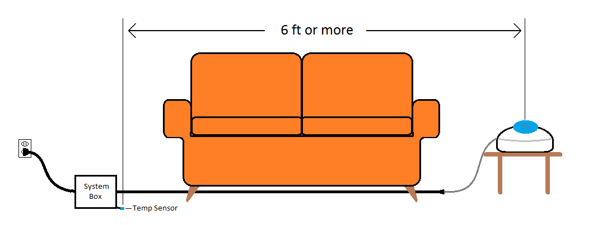
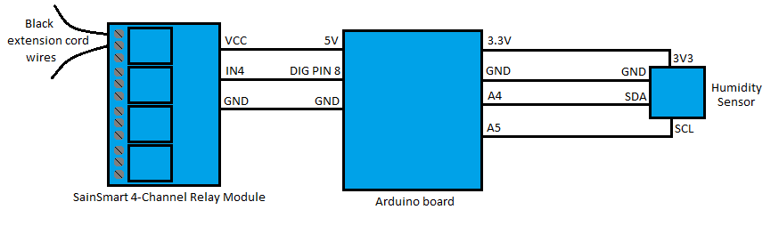

# vaporizor-controller
An Arduino project that modulates the humidity of a room to a certain range using a relay-controlled vaporizor, humidity sensor, and hysteresis.

## Overview
Our home gets dry in the winter, and we found it was hard to regulate the humidity with a standard vaporizor. Either you keep filling it up and the windows are covered in condensation, or we forget to fill up the unit until our skin starts getting really dry. So I decided to do something about it. 

I spliced an Arduino-controlled relay into an extension cord, then plugged the vaporizor into the extension cord. By sensing the humidity in the air via a sensor, the Arduino knows when to turn the relay on or off to keep the humidity at a certain range (using hysteresis).

### What You'll Need
For this project, I used:
* A vaporizor (I used a cheap $15 Vicks one from the corner store)
* A 10' extension cord
* An Arduino board (Any of [these](https://www.amazon.com/s?k=arduino&ref=nb_sb_noss_1) will do)
* An Arduino-compatible 9V power supply (Any of [these](https://www.amazon.com/s?k=arduino+power+supply&ref=nb_sb_noss_1), though you don't need more than 0.5 Amps)
* SainSmart 4-Channel Relay Module (I used [this one](https://www.amazon.com/SainSmart-101-70-101-4-Channel-Relay-Module/dp/B0057OC5O8))
* SparkFun HTU21D Humidity Sensor (See [this link](https://www.adafruit.com/product/1899))
  * If you buy the version without a header soldered on, you'll need to solder one on useing:
    * A soldering iron
    * Solder wire
    * A 5-pin male header
* A pack of male-to-female jumper wires (See [this link](https://www.amazon.com/s?k=jumper+wires&ref=nb_sb_noss_1))
* USB to USB-B cable (comes with most Arduino boards)
* A box-shaped housing (I used a little cardboard box with lid)
* Wire cutters
* Wire strippers
* 1-3 electrical wing-nuts
* Electrical tape
* Small zipties

## Electrical Configuration
***WARNING: Working with AC power can create a shock or fire hazard, which can result in serious injury or death. If you feel unconfortable doing this project, consult an expert who does. I am not responsible for any mis-wiring or complications that result in injury or death.***

Alright, now that we got the scary-yet-necessary part out of the way, here's what the completed product will look like:


Here are the steps to set up the electrical/electronics components:
1. Cut the extension cable a couple feet from the base (see room diagram)
2. Strip the thick insulation back 2-3 inches on both sides of the cut 
   - If you accidentally knick the wire insulation and expose copper, cut all wires to this point and re-strip them. You do *NOT* want any exposed wire
3. Drill holes in two opposite sides of the cardboard box and run the two extension cord ends through each side so the ends meet inside.
4. For the exposed black lines, strip the insulation back 1/4" (or just enough to fit into a relay terminal)
5. Run these two wires into the first two relay terminals (see wiring diagram below)
   - This will form a "Normally Open" connection, and the system will be off unless the arduino is powered and running the code.
6. Strip the white wires back an inch, twist the metal wires together, fold twisted part in half, and screw a wing-nut onto it.
   - There should be no exposed wire *AT ALL*.
7. If you have green wires in your extension cord (ground wires), use wing-nuts to screw on the ends or electrical tap to wrap the ends. You do not want any metal exposed, period.


## Pin Configuration
Follow the pin diagram below for the pintout between the Arduino board and support boards, using the male-to-female jumper wires to connect them.



## Software Configuration
Here are the software tasks to do:
1. Download and install the [Arduino IDE](https://www.arduino.cc/en/main/software). Make sure to choose the download for your OS.
2. Clone this repo (or download and unzip) to your desktop.
3. Inside the Arduino IDE, open the file in the unzipped folder: *vaporizorController/vaporizorController.ino*.
4. Inside the code, the humidity range is currently set to 45 to 55 degrees Fahrenheit.
   - If you want to change the range, change the desired numbers on the lines that read:
        ```cpp
        const uint8_t LOWER_THRESHOLD = 45; // in % humidity
        const uint8_t UPPER_THRESHOLD = 55; // in % humidity
        ```
5. Connect the Arduino to your computer with the USB to USB-B cable. 
6. In the Arduino IDE:
   - Select the board you're using under *Tools -> Board*
   - Select the port for the Arduino under *Tools -> Port*
   - Open the serial monitor with *Tools -> Serial Monitor*
7. Press the *Upload* button to compile and upload the code to the Arduino board. The upload should be successful.
8. Once all the pins are connected, the application will print out useful information on the terminal screen, like the humidity and the state of the relay.
9.  If you don't care about the terminal, you can just power the Arduino board from the 9V power supply. You'll probably want to drill a hole in your cardboard box to run the power cable inside.

## Optional but recommended
You'll probably want to secure the components inside the box. Mount the components by poking holes in the cardboard box and running zipties through them. Most of the components have mounting screw locations you can use to your advantage.

## Other things to note
Here are a few other tidbits:
* Make sure the humidity sensor and the vaporizor are at least 6 ft apart. Otherwise, the humidity sensed will be higher than what's in your room!
* Make sure the humidity sensor is *outside* the box or enclosure you use. Also make sure it's not sitting on carpet or fabric that can hold in moisture and cause a higher reading.
* When the Arduino light is on, the relay is closed and the vaporizor is powered.
